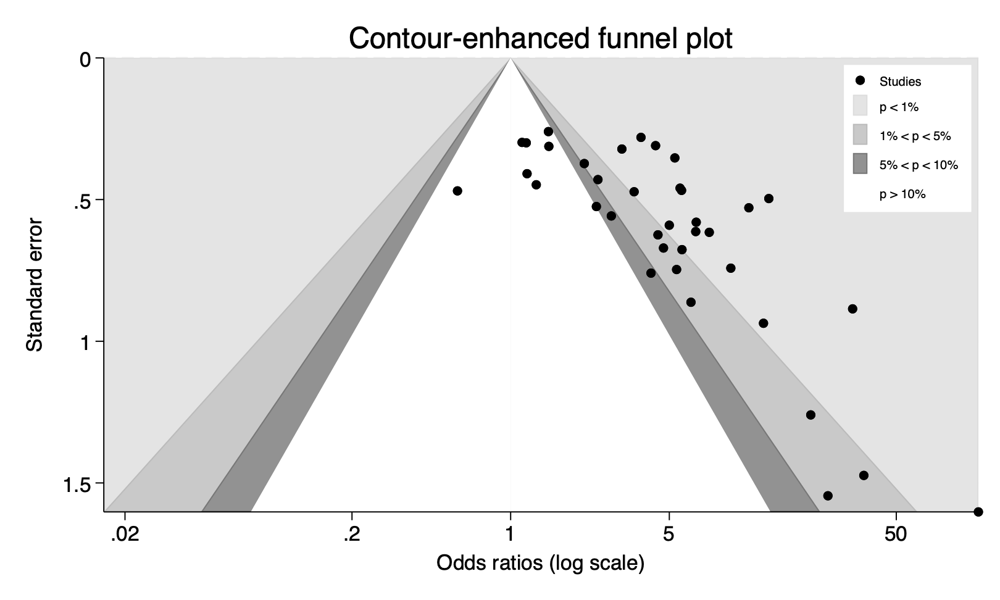
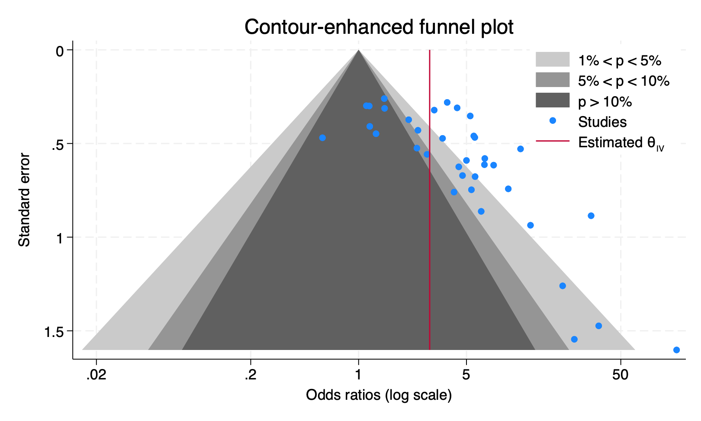

# Stata implementation of contour enhanced funnel plots

`confunnel` is a Stata command implementing contour enhanced funnel plots for meta-analysis (Peters et al., 2008). It was distributed in the Stata Journal (Palmer et al., 2008).

## Installation

To install, issue in Stata (in versions 13 and above):

```stata
net install confunnel, from("https://raw.github.com/remlapmot/confunnel-stata/master/")
```

## Implementation in official Stata

An official Stata contour enhanced funnel plot command, based on `confunnel` is available, since I think Stata version 15, through the [`meta funnelplot`](https://www.stata.com/manuals/metametafunnelplot.pdf) command as follows

```
meta funnelplot [if] [in], contours(contourspec) [options]
```

Here is a comparison of the plots that they produce (plots generated under Stata 18)

```stata
webuse nsaidsset, clear
ssc install mylabels
mylabels 0.02 0.2 1 5 50, myscale(log(@)) local(mylab)
confunnel _meta_es _meta_se, twowayopts(xtitle("Odds ratios (log scale)") `"xlabel(`mylab')"')
```



```stata
meta funnelplot, contours(1 5 10) xtitle("Odds ratios (log scale)") xlabel(`mylab')
```



## References

- Palmer, T. M., J. L. Peters, A. J. Sutton, and S. G. Moreno. Contour enhanced funnel plots for meta-analysis. Stata Journal, 2008, 8, 2, 242-254. [DOI: 10.1177%2F1536867X0800800206](https://doi.org/10.1177%2F1536867X0800800206)
- Peters, J. L., A. J. Sutton, D. R. Jones, K. R. Abrams, and L. Rushton. Contour-enhanced meta-analysis funnel plots help distinguish publication bias from other causes of asymmetry. Journal of Clinical Epidemiology, 2008, 61, 10, 991-996. [DOI: 10.1016/j.jclinepi.2007.11.010](https://doi.org/10.1016/j.jclinepi.2007.11.010)
